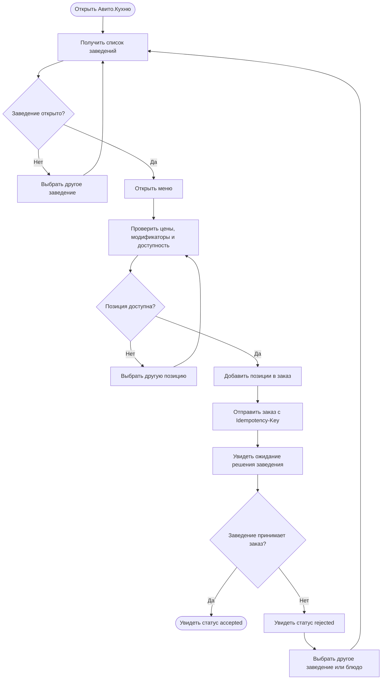
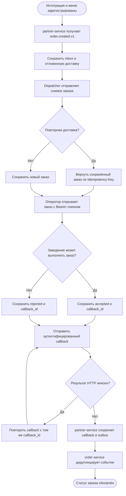
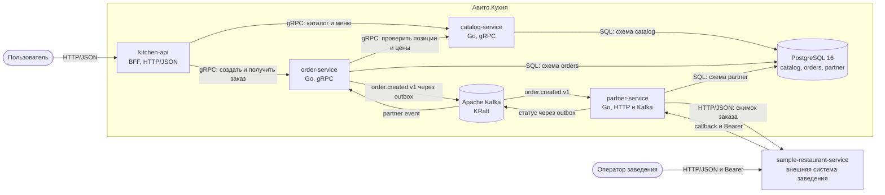
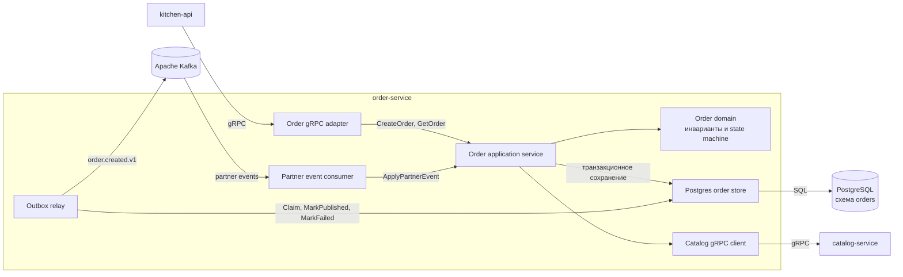
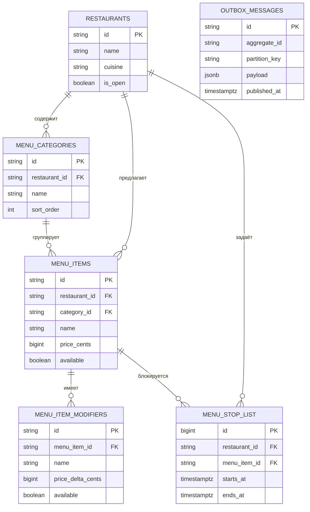
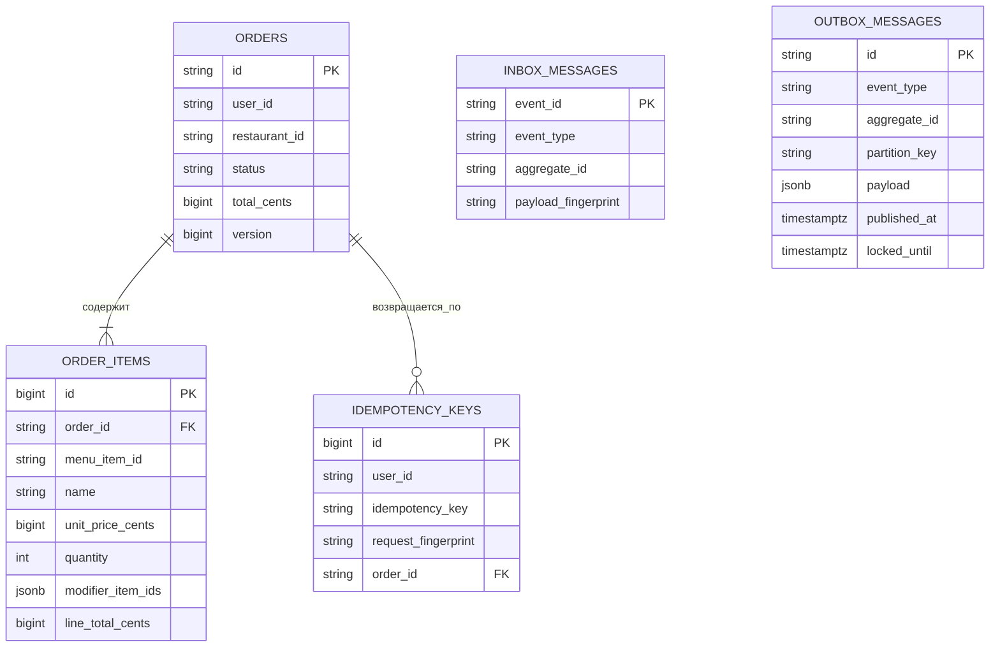
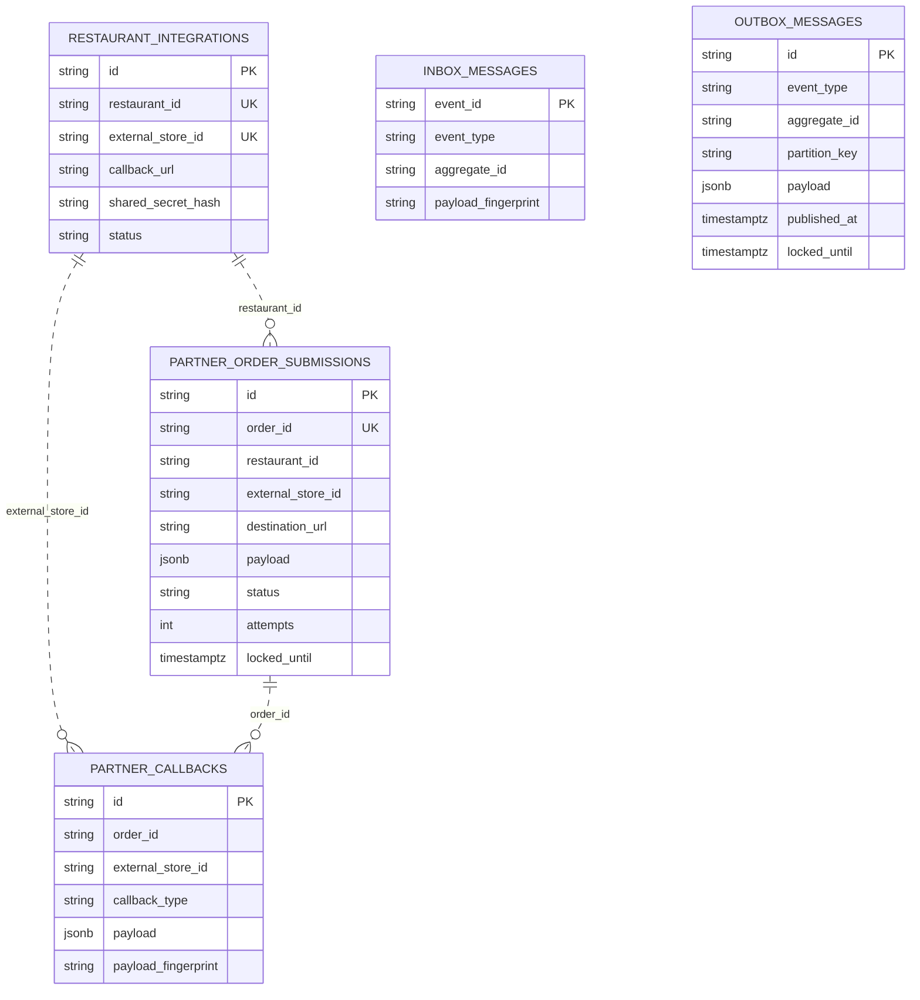

# Авито.Кухня

Backend MVP маркетплейса доставки еды. Пользователь выбирает заведение и доступные позиции меню, создаёт заказ, а отдельный сервис ресторана получает заказ и принимает либо отклоняет его.

Проект сделан как набор микросервисов на Go. Внешние границы описаны через HTTP/JSON и OpenAPI, внутренние синхронные вызовы используют gRPC, а жизненный цикл заказа между сервисами передаётся через Apache Kafka.

## Реализованные бизнес-сценарии

### Пользователь

1. Получает список доступных заведений.
2. Открывает меню с ценами, модификаторами и признаком доступности.
3. Не может заказать отсутствующую позицию.
4. Создаёт заказ с заголовком `Idempotency-Key`.
5. Безопасно повторяет тот же запрос и получает ранее созданный заказ.
6. Наблюдает статус `pending_restaurant_confirmation`.
7. После решения заведения видит `accepted` либо `rejected`.

### Заведение

1. Интеграция заведения предварительно зарегистрирована в `partner-service`.
2. `partner-service` получает событие нового заказа и доставляет неизменяемый снимок заказа в API заведения.
3. Повторная доставка не создаёт второй заказ благодаря `Idempotency-Key: <order_id>`.
4. Оператор демонстрационного ресторана открывает заказ через защищённый Bearer-токеном endpoint.
5. Оператор принимает или отклоняет заказ.
6. Ресторан отправляет аутентифицированный callback в `partner-service`.
7. Решение сохраняется транзакционно, публикуется в Kafka и применяется в `order-service`.

CJM находятся прямо в README и дополнительно хранятся как генерируемые
PlantUML-исходники: [пользователь](docs/cjm-user.puml) и
[заведение](docs/cjm-restaurant.puml).

### CJM пользователя



### CJM заведения



## Архитектура

### C4 Level 2: контейнеры



Исходник диаграммы: [docs/c4-container.puml](docs/c4-container.puml).

### C4 Level 3: компоненты order-service



Исходник диаграммы: [docs/c4-component.puml](docs/c4-component.puml).

### Сервисы

| Сервис | Ответственность | Интерфейсы |
|---|---|---|
| `kitchen-api` | BFF для web-клиента | Внешний HTTP/JSON, внутренний gRPC |
| `catalog-service` | Заведения, меню, модификаторы, доступность и стоп-лист | gRPC, PostgreSQL |
| `order-service` | Заказы, снимок цен, идемпотентность, статусы | gRPC, PostgreSQL, Kafka |
| `partner-service` | Связь с заведениями, доставка заказов, callback | HTTP, PostgreSQL, Kafka |
| `sample-restaurant-service` | Пример отдельного заведения из ТЗ | HTTP, состояние в памяти |

### Почему используются разные протоколы

- HTTP/JSON на границе web-клиента совместим с браузером и описывается OpenAPI.
- HTTP callback подходит для внешней интеграции ресторана и не требует от партнёра поддержки gRPC.
- gRPC/protobuf используется для типизированных внутренних запросов между `kitchen-api`, каталогом и заказами.
- Kafka отделяет создание заказа от нестабильной внешней интеграции и позволяет независимо масштабировать обработчики.

В Compose используется официальный образ `apache/kafka:4.3.1`: один узел совмещает роли broker и controller в режиме KRaft, поэтому ZooKeeper не нужен. Сервисы внутри Docker-сети подключаются к `kafka:9092`, а с хоста брокер доступен по `localhost:19092`. Это локальная конфигурация для MVP; production-кластеру потребуются отдельные controller-узлы, репликация и защищённые listener-ы.

Архитектурные артефакты:

- [C4 Container](docs/c4-container.puml);
- [C4 Component для order-service](docs/c4-component.puml);
- [ADR: микросервисы, gRPC и Kafka](docs/adr/0001-microservices-grpc-kafka.md);
- [план реализации с использованием ИИ](docs/implementation-plan.md).

## Поток заказа

1. `kitchen-api` передаёт команду создания заказа в `order-service` по gRPC.
2. `order-service` сначала ищет сохранённый заказ по пользователю и ключу идемпотентности. Для новой команды запрашивает у `catalog-service` открытость ресторана, доступность позиций и актуальные цены.
3. Заказ, снимок строк заказа, ключ идемпотентности и `order.created.v1` записываются в одну транзакцию PostgreSQL.
4. Outbox relay публикует событие в `orders.events.v1`.
5. `partner-service` в одной транзакции фиксирует inbox и создаёт отложенную доставку заведению.
6. Dispatcher с арендой строки отправляет заказ в `sample-restaurant-service`.
7. Ресторан сохраняет первое решение и отправляет callback с постоянным `callback_id`.
8. `partner-service` проверяет интеграцию и токен, сохраняет callback и partner outbox.
9. Событие из `partner.events.v1` применяется в `order-service` транзакцией inbox плюс смена статуса.
10. Web-клиент получает новый статус через `GET /v1/orders/{orderId}`.

## Модель надёжности

Kafka рассматривается как доставка **at-least-once**. Проект намеренно не заявляет сквозной exactly-once.

- Каждое событие имеет постоянный `event_id`.
- Ключ партиционирования равен `order_id`, поэтому события одного заказа упорядочены в партиции.
- Производители записывают бизнес-состояние и outbox в одной транзакции.
- Consumers подтверждают Kafka offset только после успешного локального commit.
- Inbox делает повторную доставку события безопасной.
- Публикация после неясного результата может повториться; логическая идентичность события при retry не меняется.
- Доставка в ресторан идемпотентна по `order_id`.
- Повтор callback использует тот же `callback_id` и время решения.
- Невалидное событие блокирует продвижение своей партиции и остаётся заметным в логах. Quarantine/redrive вынесен за границы MVP.
- DB-сервисы ожидают готовность PostgreSQL до 30 секунд с ограниченным exponential backoff.

## Идемпотентность заказа

`POST /v1/orders` требует `Idempotency-Key` длиной от 8 до 128 символов.

Сохранённый заказ читается до обращения к каталогу: повтор не зависит от изменения цен, стоп-листа, закрытия ресторана или временной недоступности `catalog-service`. Возвращаются текущий статус заказа и исходный снимок его позиций и цен. Проверка ключа повторяется внутри транзакции под advisory lock, поэтому одновременные запросы не создают второй заказ или outbox event.

- Тот же пользователь, тот же ключ и семантически тот же payload: `200 OK` и исходный заказ.
- Тот же пользователь и ключ, но другой payload: `409 Conflict`.
- Новый ключ: `201 Created`.

Отпечаток строится по нормализованной команде, а не по исходным байтам JSON.

## OpenAPI и API

Внешние HTTP-контракты описаны в OpenAPI и версионируются вместе с кодом:

| Спецификация | Граница | Назначение |
|---|---|---|
| [kitchen-api.yaml](api/openapi/kitchen-api.yaml) | Web-клиент -> `kitchen-api` | Каталог, меню, создание и чтение заказа |
| [partner-api.yaml](api/openapi/partner-api.yaml) | Заведение -> `partner-service` | Callback со статусом заказа |
| [sample-restaurant-api.yaml](api/openapi/sample-restaurant-api.yaml) | `partner-service` и оператор -> заведение | Доставка, просмотр и решение заказа |

### Web API

Спецификация: [api/openapi/kitchen-api.yaml](api/openapi/kitchen-api.yaml).

| Метод | Endpoint | Назначение |
|---|---|---|
| `GET` | `/v1/restaurants` | Список заведений |
| `GET` | `/v1/restaurants/{restaurantId}/menu` | Меню и доступность |
| `POST` | `/v1/orders` | Создание заказа |
| `GET` | `/v1/orders/{orderId}` | Получение заказа и статуса |

`X-User-ID` имитирует идентификатор пользователя. Это не аутентификация: по условию задания пользовательские authn/authz не реализуются.

### Партнёрский callback API

Спецификация: [api/openapi/partner-api.yaml](api/openapi/partner-api.yaml).

`POST /callbacks/order-status` принимает `accepted` или `rejected`. Активная интеграция определяется по `restaurant_id` и `external_store_id`, а Bearer-токен сравнивается с сохранённым SHA-256 digest.

Первый callback возвращает `202`, точный повтор возвращает `200`, неверный токен возвращает `401`, конфликт идентичности возвращает `409`.

### API примера заведения

Спецификация: [api/openapi/sample-restaurant-api.yaml](api/openapi/sample-restaurant-api.yaml).

| Метод | Endpoint | Назначение |
|---|---|---|
| `POST` | `/orders` | Доставка заказа платформой |
| `GET` | `/orders/{orderId}` | Просмотр заказа оператором |
| `POST` | `/orders/{orderId}/status` | Принять или отклонить заказ |

Операторские endpoints требуют `Authorization: Bearer <SAMPLE_RESTAURANT_OPERATOR_TOKEN>`.

## Локальный запуск

Требования:

- Docker с Compose v2;
- `curl` и `jq` для автоматического smoke-теста.

Запуск:

~~~bash
docker compose build --no-cache
docker compose up -d
docker compose ps
~~~

Проверка полного сценария:

~~~bash
sh scripts/smoke.sh
~~~

Остановка:

~~~bash
docker compose down
~~~

`docker-compose.yml` является единственным рабочим Compose-стеком проекта.
Важное уточнение, что при использовании команды для остановки с флагом -v, при последующем поднятии docker-compose у smoke-тестов будет ошибка из-за удаления томов. В таком случаи нужно пересобрать образ не из кэша, а с 0.

При выполнении smoke-тестов, возможен случай, что последний этап не выполняется, в таком случае стоит попробовать снова такую последовательность команд:

~~~bash
sudo docker compose build --no-cache --pull
sudo docker compose up -d
sudo docker compose ps
sh scripts/smoke.sh
~~~

Либо:

~~~bash
sudo docker compose restart partner-service order-service
sh scripts/smoke.sh
~~~

## Ручная работа с API

Smoke-тест проверяет основной сценарий автоматически, но все шаги можно выполнить вручную. Клиентское HTTP API доступно через `kitchen-api` на порту `8080`, а `sample-restaurant-service` на порту `8084` имитирует интерфейс оператора ресторана.

Для примеров нужны `curl` и `jq`. После `docker compose up -d --build` задайте переменные:

```bash
KITCHEN_API_URL="http://localhost:8080"
SAMPLE_RESTAURANT_URL="http://localhost:8084"
OPERATOR_TOKEN="development-only-operator-secret"

RUN_ID="$(date +%s)-$$"
USER_ID="manual-user-$RUN_ID"
IDEMPOTENCY_KEY="manual-order-$RUN_ID"
```

`X-User-ID` имитирует идентификатор авторизованного пользователя. Для чтения заказа нужно использовать то же значение, с которым он был создан.

### 1. Получить рестораны и меню

```bash
curl -sS "$KITCHEN_API_URL/v1/restaurants" | jq

curl -sS "$KITCHEN_API_URL/v1/restaurants/rst-pizza-1/menu" | jq
```

Позиции находятся в `categories[].items[]`. В демонстрационных данных `item-margherita` доступна, `item-lasagna` недоступна, а `mod-extra-cheese` является модификатором.

Вывести позиции в компактном виде:

```bash
curl -sS "$KITCHEN_API_URL/v1/restaurants/rst-pizza-1/menu" |
  jq '.categories[].items[] | {id, name, available, priceCents}'
```

### 2. Создать заказ

```bash
ORDER_BODY='{
  "restaurantId": "rst-pizza-1",
  "items": [
    {
      "menuItemId": "item-margherita",
      "quantity": 1,
      "modifierItemIds": ["mod-extra-cheese"]
    }
  ]
}'

curl -sS \
  -o /tmp/manual-order.json \
  -w 'HTTP %{http_code}\n' \
  -X POST "$KITCHEN_API_URL/v1/orders" \
  -H 'Content-Type: application/json' \
  -H "X-User-ID: $USER_ID" \
  -H "Idempotency-Key: $IDEMPOTENCY_KEY" \
  --data "$ORDER_BODY"

jq . /tmp/manual-order.json
ORDER_ID="$(jq -er '.id' /tmp/manual-order.json)"
echo "created order: $ORDER_ID"
```

Успешное создание возвращает HTTP `201 Created`.

### 3. Получить заказ и проверить идемпотентность

```bash
curl -sS "$KITCHEN_API_URL/v1/orders/$ORDER_ID" \
  -H "X-User-ID: $USER_ID" | jq
```

Повторите запрос создания с теми же пользователем, ключом и телом:

```bash
curl -sS -i \
  -X POST "$KITCHEN_API_URL/v1/orders" \
  -H 'Content-Type: application/json' \
  -H "X-User-ID: $USER_ID" \
  -H "Idempotency-Key: $IDEMPOTENCY_KEY" \
  --data "$ORDER_BODY"
```

Повтор возвращает HTTP `200 OK` и тот же `id`, не создавая дубликат. Проверить конфликт ключа, изменив количество:

```bash
CONFLICT_BODY="$(printf '%s' "$ORDER_BODY" | jq '.items[0].quantity = 2')"
curl -sS -i \
  -X POST "$KITCHEN_API_URL/v1/orders" \
  -H 'Content-Type: application/json' \
  -H "X-User-ID: $USER_ID" \
  -H "Idempotency-Key: $IDEMPOTENCY_KEY" \
  --data "$CONFLICT_BODY"
```

Ожидается HTTP `409 Conflict`. Исходный заказ не меняется.

### 4. Обработать заказ от имени ресторана

`partner-service` получает событие из Kafka и доставляет заказ в `sample-restaurant-service` асинхронно. Если первый запрос вернул `404`, подождите несколько секунд и повторите его; при длительном ожидании проверьте логи сервисов:

```bash
curl -sS "$SAMPLE_RESTAURANT_URL/orders/$ORDER_ID" \
  -H "Authorization: Bearer $OPERATOR_TOKEN" | jq
```

Принять заказ:

```bash
curl -sS -i \
  -X POST "$SAMPLE_RESTAURANT_URL/orders/$ORDER_ID/status" \
  -H 'Content-Type: application/json' \
  -H "Authorization: Bearer $OPERATOR_TOKEN" \
  --data '{"status":"accepted"}'
```

Чтобы отклонить новый заказ, передайте `{"status":"rejected"}`. Первая отправка решения возвращает HTTP `202 Accepted`, точный повтор может вернуть `200 OK`.

Решение асинхронно проходит через callback `partner-service`, Kafka и consumer `order-service`. Наблюдать за статусом со стороны пользователя:

```bash
while true; do
  curl -sS "$KITCHEN_API_URL/v1/orders/$ORDER_ID" \
    -H "X-User-ID: $USER_ID" |
    jq '{id, status}'
  sleep 2
done
```

Цикл останавливается сочетанием `Ctrl+C`.

### 5. Проверить ошибку недоступной позиции

```bash
curl -sS -i \
  -X POST "$KITCHEN_API_URL/v1/orders" \
  -H 'Content-Type: application/json' \
  -H "X-User-ID: $USER_ID" \
  -H "Idempotency-Key: unavailable-$RUN_ID" \
  --data '{
    "restaurantId": "rst-pizza-1",
    "items": [
      {
        "menuItemId": "item-lasagna",
        "quantity": 1
      }
    ]
  }'
```

Ожидаемый результат: HTTP `400 Bad Request` и JSON с полями `code` и `message`.

Новый заказ в ресторан с `isOpen: false` также возвращает `400`, но просмотр его меню остаётся доступным. Повтор ранее созданного заказа с исходным ключом и телом возвращает `200` даже после закрытия ресторана.

### Наблюдение и графические API-клиенты

Во время сценария можно открыть второй терминал и следить за прохождением заказа:

```bash
sudo docker compose logs -f --tail=100 \
  kitchen-api catalog-service order-service partner-service sample-restaurant-service
```

Посмотреть доступные Kafka-топики:

```bash
sudo docker compose exec kafka \
  /opt/kafka/bin/kafka-topics.sh \
  --bootstrap-server kafka:9092 \
  --list
```

Вместо `curl` можно импортировать спецификации из `api/openapi` в Postman, Bruno или Swagger Editor. Для клиентского API используется базовый URL `http://localhost:8080`; для операций с заказами добавляются `X-User-ID` и, при создании, `Idempotency-Key`.

## Схема базы данных

В Compose используется один экземпляр PostgreSQL, но каждый сервис владеет отдельной схемой. Между схемами нет внешних ключей: связи между сервисами хранятся как стабильные идентификаторы и синхронизируются через API/события.

### Схема `catalog`



| Таблица | Назначение и связи |
|---|---|
| `restaurants` | Заведения; `id` используется во всех сервисах как логическая ссылка |
| `menu_categories` | Категории, внешний ключ на `restaurants` |
| `menu_items` | Блюда, внешние ключи на заведение и категорию |
| `menu_item_modifiers` | Модификаторы и изменение цены, внешний ключ на блюдо |
| `menu_stop_list` | Интервалы временной недоступности блюда |
| `outbox_messages` | Зарезервировано для будущих событий изменения каталога |

Эффективная доступность вычисляется как `menu_items.available` без активной записи стоп-листа. Миграция `0002_sample_data.sql` создаёт демонстрационное заведение и меню.

### Схема `orders`



| Таблица | Назначение и связи |
|---|---|
| `orders` | Агрегат заказа, `user_id`, `restaurant_id`, статус, сумма и версия |
| `order_items` | Неизменяемый снимок названий, цен, количества и модификаторов |
| `idempotency_keys` | Уникальная пара `(user_id, idempotency_key)` и отпечаток команды |
| `outbox_messages` | События, записанные в транзакции заказа и ожидающие публикации |
| `inbox_messages` | Обработанные partner-события и их semantic fingerprint |

### Схема `partner`

Пунктирные связи ниже логические: они поддерживаются стабильными идентификаторами,
но намеренно не закреплены внешними ключами в PostgreSQL.



| Таблица | Назначение и связи |
|---|---|
| `restaurant_integrations` | Соответствие внутреннего ресторана внешнему store, URL и digest секрета |
| `partner_order_submissions` | Снимок заказа, состояние доставки, attempts и lease |
| `partner_callbacks` | Callback заведения, payload и fingerprint для дедупликации |
| `inbox_messages` | Обработанные `order.created.v1` |
| `outbox_messages` | Решения ресторана, ожидающие публикации |

`orders.user_id` хранит внешний идентификатор пользователя без FK, поскольку пользовательский сервис не входит в задание. `restaurant_id` связывает каталог, заказ и интеграцию логически; `external_store_id` связывает платформу с системой заведения.

Все миграции находятся в [migrations](migrations). Сервисы применяют только собственную директорию до открытия сетевых портов. Runner сначала создаёт общий реестр миграций в транзакции под глобальной advisory lock, а затем использует отдельную advisory lock для каждого сервиса. Поэтому параллельный старт на пустой базе безопасен; checksum уже применённых миграций дополнительно защищает от их незаметного изменения.

### Health endpoints

- `kitchen-api`: [http://localhost:8080/healthz](http://localhost:8080/healthz)
- `catalog-service`: [http://localhost:8081/healthz](http://localhost:8081/healthz)
- `order-service`: [http://localhost:8082/healthz](http://localhost:8082/healthz)
- `partner-service`: [http://localhost:8083/healthz](http://localhost:8083/healthz)
- `sample-restaurant-service`: [http://localhost:8084/healthz](http://localhost:8084/healthz)

## Конфигурация

Основные переменные перечислены в [.env.example](.env.example).

| Переменная | Назначение | Значение по умолчанию |
|---|---|---|
| `DATABASE_URL` | Подключение к PostgreSQL | Обязательно для DB-сервисов |
| `KAFKA_BROKERS` | Адреса брокеров Kafka | Обязательно для producer/consumer |
| `ORDER_EVENTS_TOPIC` | События заказов | `orders.events.v1` |
| `PARTNER_EVENTS_TOPIC` | Решения заведений | `partner.events.v1` |
| `KAFKA_CONSUMER_RETRY_DELAY` | Задержка повтора текущей записи/commit | `1s` |
| `OUTBOX_RELAY_BATCH_SIZE` | Размер batch outbox | `50` |
| `OUTBOX_RELAY_LOCK_TTL` | Срок владения записью outbox | `30s` |
| `PARTNER_DISPATCH_MAX_ATTEMPTS` | Предел доставки в ресторан | `5` |
| `PARTNER_HTTP_TIMEOUT` | Timeout одного запроса в ресторан | `3s` |
| `PARTNER_CALLBACK_TOKEN` | Секрет callback интеграции | Обязательно для sample service |
| `SAMPLE_RESTAURANT_OPERATOR_TOKEN` | Токен локального оператора | Обязательно для sample service |
| `SHUTDOWN_TIMEOUT` | Бюджет graceful shutdown | `10s` |

Секреты в Compose имеют префикс `development-only` и предназначены только для локальной демонстрации. В production потребуются TLS/mTLS и secret manager.

## Проверка кода

~~~bash
go test ./...
go test -race ./...
go vet ./...
golangci-lint run -c .golangci.yml --timeout=5m
go build ./cmd/...
~~~

В `.gitlab-ci.yml` настроены lint, race-тесты с покрытием и сборка всех сервисов. Эта конфигурация предназначена для GitLab и сама по себе не запускает проверки на GitHub. Версия Go `1.23.5` согласована между `go.mod`, CI и Dockerfile.

## Структура репозитория

~~~text
api/openapi/       внешние HTTP-контракты
api/proto/         исходные внутренние gRPC-контракты
cmd/               точки входа сервисов
docs/              CJM, C4, ADR и планы реализации
gen/go/            сгенерированный protobuf/gRPC-код
internal/catalog/  домен и адаптеры каталога
internal/order/    домен, application layer и адаптеры заказов
internal/partner/  интеграция заведений, dispatcher и callback
internal/sample/   демонстрационное заведение
internal/platform/ общая инфраструктура событий, Kafka, миграций и runtime
migrations/        миграции по владельцам схем
scripts/           автоматические проверочные сценарии
~~~

## Осознанные ограничения MVP

- Нет аутентификации пользователя, платежей, курьеров, ETA и геопоиска.
- Внешний ресторанный сценарий ограничен решением `accepted/rejected`. Domain state machine уже допускает `preparing/ready/completed/cancelled`, но API этих переходов не входит в текущий CJM.
- Демонстрационный ресторан хранит заказы и callback-состояние в памяти; рестарт очищает их.
- Poison event блокирует Kafka-партицию до ручного вмешательства; quarantine/redrive не реализован.
- Health endpoints являются liveness-проверками, а не полной диагностикой зависимостей.
- Одна PostgreSQL-инсталляция выбрана для простого Compose, схемы при этом разделены по владельцам.


## Промпт для ИИ-агента

Ниже приведён самодостаточный master prompt, по которому coding agent может
спроектировать и реализовать этот MVP с нуля.

~~~text
Ты ведущий Go-разработчик и архитектор распределённых систем. Спроектируй,
реализуй, протестируй и задокументируй production-minded MVP сервиса
«Авито.Кухня» для заказа еды из ресторанов.

Работай автономно до готового результата. Не останавливайся после плана или
создания каркаса. Сначала изучи существующий репозиторий и сохрани полезные
файлы, затем составь краткий план и последовательно реализуй систему.
Не удаляй и не откатывай пользовательские изменения. Для каждой существенной
функции сначала сформулируй проверяемый инвариант, затем добавь тест и
реализацию. Не заявляй о готовности без свежего полного прогона проверок.

1. Цель и границы MVP

Нужно реализовать backend маркетплейса доставки еды со следующими участниками:
- пользователь просматривает рестораны и меню, создаёт заказ и получает его
  актуальный статус
- ресторан получает неизменяемый снимок заказа, принимает или отклоняет его и
  сообщает решение платформе
- платформа надёжно проводит заказ через несколько микросервисов при возможных
  повторах сообщений, рестартах и временной недоступности внешнего ресторана

В MVP не входят пользовательская аутентификация, платежи, курьеры, ETA,
геопоиск и полноценный frontend. Пользователь передаётся тестовым заголовком
X-User-ID

2. Технологический стек

- Go 1.23.5.
- Модуль:
  github.com/talense-tasks/backend-trainee-assignment-autumn-2026-flow-2-brartemhse-079cad3c
- PostgreSQL 16
- Apache Kafka 4.3.1
- gRPC и protobuf для синхронного межсервисного API
- HTTP/JSON и OpenAPI 3 для web API
- github.com/jackc/pgx/v5 для PostgreSQL
- github.com/segmentio/kafka-go для Kafka
- google.golang.org/grpc и google.golang.org/protobuf
- Dockerfile и docker-compose.yml для запуска
- golangci-lint и GitLab CI для статического анализа и проверок

Не добавляй framework без практической необходимости. Предпочитай стандартную
библиотеку Go и явные зависимости.

3. Архитектура и сервисные границы

Реализуй пять отдельных процессов:

1. kitchen-api
   - BFF для web-клиента.
   - Принимает внешний HTTP/JSON.
   - Не владеет базой данных.
   - Вызывает catalog-service и order-service по gRPC.

2. catalog-service
   - Владеет ресторанами, категориями меню, позициями, модификаторами,
     доступностью и стоп-листом.
   - Предоставляет только gRPC API.
   - Владеет схемой PostgreSQL catalog.

3. order-service
   - Владеет заказом, снимком цен, идемпотентностью и state machine статусов.
   - Предоставляет gRPC API.
   - Проверяет позиции и цены через catalog-service по gRPC.
   - Публикует создание заказа в Kafka через transactional outbox.
   - Получает решения ресторана из Kafka и применяет их через inbox.
   - Владеет схемой PostgreSQL orders.

4. partner-service
   - Владеет регистрацией интеграций ресторанов.
   - Получает события созданных заказов из Kafka.
   - Надёжно доставляет снимок заказа в HTTP API ресторана.
   - Принимает аутентифицированные callbacks ресторана.
   - Публикует решение ресторана в Kafka через transactional outbox.
   - Владеет схемой PostgreSQL partner.

5. sample-restaurant-service
   - Имитирует внешнюю систему отдельного ресторана.
   - Принимает заказ по HTTP идемпотентно.
   - Даёт оператору просмотреть, принять или отклонить заказ.
   - Отправляет callback в partner-service.
   - Для MVP может хранить состояние в памяти.

Соблюдай направление зависимостей: domain и application packages не должны
зависеть от HTTP, gRPC, SQL, Kafka или process bootstrap. Транспортные и
инфраструктурные адаптеры зависят от application/domain, но не наоборот.

4. Пользовательский HTTP API

Опиши контракт в api/openapi/kitchen-api.yaml и реализуй:

- GET /v1/restaurants
  Возвращает рестораны с id, name, cuisine и is_open.

- GET /v1/restaurants/{restaurantId}/menu
  Возвращает категории, позиции, цены в минимальных денежных единицах,
  модификаторы и вычисленную доступность.

- POST /v1/orders
  Требует X-User-ID и Idempotency-Key.
  Idempotency-Key должен иметь длину от 8 до 128 символов.
  Принимает restaurant_id и непустой список items:
  menu_item_id, quantity и modifier_item_ids.

- GET /v1/orders/{orderId}
  Требует X-User-ID и не должен раскрывать заказ другого пользователя.

Правила POST /v1/orders:

- новый ключ и валидный payload: 201 Created;
- тот же пользователь, тот же ключ и семантически тот же payload:
  200 OK и ранее созданный заказ;
- тот же пользователь и ключ, но другой нормализованный payload:
  409 Conflict;
- отсутствующий или неверный заголовок, пустой заказ, quantity <= 0 и другие
  ошибки валидации: 400 Bad Request;
- неизвестный ресурс: 404 Not Found;
- недоступная позиция, закрытый ресторан или конфликт бизнес-инварианта:
  подходящий 409 или 422, единообразно зафиксированный в OpenAPI.

Используй единый JSON-формат ошибок. Не прокидывай внутренние SQL, Kafka или
gRPC ошибки клиенту. Корректно сопоставляй domain errors с HTTP и gRPC codes.

5. Внутренние gRPC-контракты

Создай versioned proto-файлы и сгенерированный Go-код.

CatalogService:

- ListRestaurants;
- GetRestaurantMenu;
- ValidateOrderItems.

ValidateOrderItems получает restaurant_id и список requested items. Он должен
проверить существование ресторана, его открытость, принадлежность всех позиций
этому ресторану, quantity, доступность позиции, активный стоп-лист и
допустимость модификаторов. Ответ содержит нормализованный снимок строк заказа
и total_cents.

OrderService:

- CreateOrder;
- GetOrder.

CreateOrder получает request_id, user_id, idempotency_key, restaurant_id и
items. Ответ содержит Order и признак reused_idempotency_key.

PartnerService:

- GetIntegration;
- RegisterIntegration.

Не меняй номера существующих protobuf fields после публикации. go_package
должен указывать на gen/go внутри текущего module path. Добавь воспроизводимую
команду protoc для генерации .pb.go и _grpc.pb.go файлов.

6. Модель каталога и схема catalog

Создай SQL migrations для:

- restaurants:
  id PK, name, cuisine, is_open, created_at, updated_at;
- menu_categories:
  id PK, restaurant_id FK, name, sort_order, timestamps;
- menu_items:
  id PK, restaurant_id FK, category_id FK, name, description, price_cents > 0,
  available, timestamps;
- menu_item_modifiers:
  id PK, menu_item_id FK, name, price_delta_cents, available, timestamps;
- menu_stop_list:
  id PK, restaurant_id FK, menu_item_id FK, reason, starts_at, ends_at,
  unique restaurant_id + menu_item_id;
- outbox_messages:
  зарезервированная таблица для будущих событий каталога.

Добавь демонстрационные данные: открытый ресторан, несколько категорий, доступную и недоступную позиции и модификатор.

7. Модель заказа и схема orders

Order является агрегатом со следующими основными полями:

- id, user_id, restaurant_id;
- status;
- total_cents;
- version;
- created_at и updated_at;
- неизменяемый список order_items со снимком name, unit_price_cents, quantity,
  modifier_item_ids и line_total_cents.

Поддержи статусы:

- pending_restaurant_confirmation;
- accepted;
- rejected;
- preparing;
- ready;
- completed;
- cancelled.

Внешний MVP обязан реализовать переход из pending_restaurant_confirmation
только в accepted или rejected. Проверку допустимых переходов держи в domain.
Не разрешай повторному или устаревшему событию откатывать уже применённый
статус.

Создай таблицы:

- orders;
- order_items с FK на orders;
- idempotency_keys с unique(user_id, idempotency_key), request_fingerprint и
  FK на orders;
- inbox_messages с event_id PK и payload_fingerprint;
- outbox_messages с envelope metadata, payload, publish state, attempts,
  locked_by, locked_until и next_attempt_at.

В одной транзакции сохраняй order, order_items, idempotency record и
order.created.v1 в outbox. Денежные значения храни как целые price_cents,
никаких float.

8. Интеграция ресторана и схема partner

Создай таблицы:

- restaurant_integrations:
  id, unique restaurant_id, unique external_store_id, callback_url,
  shared_secret_hash, status active/disabled, timestamps;
- partner_order_submissions:
  id, unique order_id, restaurant_id, external_store_id, destination_url,
  payload, correlation_id, source_event_id, status, attempts, last_error,
  lease fields и submitted_at;
- partner_callbacks:
  callback id, order_id, external_store_id, callback_type, payload,
  payload_fingerprint, received_at;
- inbox_messages для order.created.v1;
- outbox_messages для решений ресторана.

Миграционный runner должен:

- выполнять versioned SQL migrations до открытия сетевых портов;
- вести общий реестр применённых миграций;
- хранить checksum и отклонять незаметно изменённую применённую migration;
- сериализовать bootstrap реестра глобальной PostgreSQL advisory lock;
- использовать отдельную advisory lock на владельца схемы;
- безопасно работать при параллельном старте нескольких сервисов.

9. Kafka и контракты событий

Используй topics:

- orders.events.v1;
- partner.events.v1.

Consumer groups:

- partner-service-orders-v1;
- order-service-partner-events-v1.

Общий event envelope должен содержать:

- event_id;
- event_type;
- event_version;
- occurred_at;
- producer;
- aggregate_type;
- aggregate_id;
- partition_key;
- correlation_id;
- causation_id;
- payload.

Для всех событий одного заказа partition_key должен быть равен order_id.
Один логический event сохраняет тот же event_id при повторной публикации после
неясного результата.

order.created.v1 содержит:

- order_id, user_id, restaurant_id, status, total_cents;
- items со снимком menu_item_id, name, unit_price_cents, quantity,
  modifier_item_ids и line_total_cents.

partner-service публикует:

- partner.order_accepted.v1;
- partner.order_rejected.v1.

Payload решения содержит callback_id, order_id, restaurant_id,
external_store_id, status и partner_occurred_at.

10. Гарантии доставки и согласованности

Считай Kafka системой at-least-once. Не заявляй сквозной exactly-once.

Transactional outbox:

- бизнес-состояние и событие записываются одной DB transaction;
- relay выбирает ограниченный batch доступных записей;
- несколько relay workers координируются через row claiming и lease;
- публикация в Kafka происходит вне долгой DB transaction;
- после подтверждённой публикации запись помечается published;
- неизвестный результат публикации может привести к повтору с тем же event_id;
- failed publish увеличивает attempts, сохраняет last_error и задаёт
  next_attempt_at;
- locked_until позволяет восстановиться после падения worker.

Kafka consumers:

- валидируют envelope и payload до применения;
- записывают inbox и бизнес-изменение одной локальной transaction;
- подтверждают offset только после успешного commit;
- duplicate event_id с тем же semantic fingerprint безопасно пропускают;
- duplicate event_id с другим fingerprint считают конфликтом данных;
- при временной ошибке не подтверждают запись и повторяют её с ограниченной
  задержкой;
- poison event не должен бесшумно теряться. Для MVP допустимо остановить
  продвижение конкретной partition и оставить явную ошибку в логах;
- quarantine и redrive можно оставить документированным ограничением MVP.

Явно проверь тестами crash schedules:

- падение до и после DB commit;
- падение до и после Kafka publish;
- неясный publish result и повтор события;
- redelivery после успешного DB commit, но до offset commit;
- одинаковый event_id с тем же и отличающимся payload;
- истечение lease во время паузы worker;
- отмена context во время блокирующей операции.

11. Доставка заказа ресторану

После order.created.v1 partner-service должен одной transaction:

- дедуплицировать событие через inbox;
- найти активную restaurant integration;
- сохранить неизменяемый submission payload;
- создать pending delivery без сетевого HTTP вызова внутри transaction.

Отдельный dispatcher:

- опрашивает pending submissions ограниченными batch;
- получает lease с locked_by и locked_until;
- выполняет HTTP request с timeout 3s;
- передаёт Idempotency-Key, равный order_id;
- не удерживает DB transaction во время HTTP;
- при успехе помечает submitted;
- при временной ошибке планирует повтор через 5s;
- ограничивает число попыток значением 5;
- после исчерпания попыток переводит запись в failed;
- после потери lease не выполняет новые небезопасные эффекты.

sample-restaurant-service должен дедуплицировать POST /orders по order_id.
Точный повтор возвращает сохранённый заказ и не создаёт дубль.

12. Решение ресторана и callback

Опиши api/openapi/sample-restaurant-api.yaml и реализуй:

- POST /orders для доставки заказа платформой;
- GET /orders/{orderId} для оператора;
- POST /orders/{orderId}/status для accepted или rejected.

Операторские endpoints требуют:
Authorization: Bearer <SAMPLE_RESTAURANT_OPERATOR_TOKEN>.

Первое принятое оператором решение становится неизменяемым. Создай постоянный
callback_id и occurred_at. Если HTTP результат callback неясен, повторяй тот же
callback с теми же callback_id и occurred_at.

Опиши api/openapi/partner-api.yaml и реализуй:

- POST /callbacks/order-status.

Callback содержит callback_id, order_id, restaurant_id, external_store_id,
status и occurred_at. partner-service находит активную integration и проверяет
Bearer token сравнением с сохранённым SHA-256 digest.

Семантика ответа:

- первый валидный callback: 202 Accepted;
- точный повтор: 200 OK;
- неверный token: 401 Unauthorized;
- неизвестная или disabled integration: подходящий 404/409;
- тот же callback_id с другой identity или payload: 409 Conflict;
- invalid payload/status: 400 Bad Request.

Callback record и partner outbox event сохраняй одной transaction. Затем
order-service применяет событие через inbox и domain state transition.

13. Runtime, конфигурация и lifecycle

Конфигурацию считывай из environment variables и валидируй при startup.
Поддержи как минимум:

- HTTP_ADDR, GRPC_ADDR;
- DATABASE_URL;
- CATALOG_GRPC_TARGET, ORDER_GRPC_TARGET;
- KAFKA_BROKERS;
- topic и consumer group names;
- KAFKA_CONSUMER_RETRY_DELAY;
- OUTBOX_RELAY_BATCH_SIZE, OUTBOX_RELAY_POLL_INTERVAL,
  OUTBOX_RELAY_LOCK_TTL, OUTBOX_RELAY_RETRY_DELAY;
- PARTNER_DISPATCH_BATCH_SIZE, PARTNER_DISPATCH_POLL_INTERVAL,
  PARTNER_DISPATCH_LOCK_TTL, PARTNER_DISPATCH_RETRY_DELAY,
  PARTNER_DISPATCH_MAX_ATTEMPTS;
- PARTNER_HTTP_TIMEOUT;
- PARTNER_CALLBACK_URL, PARTNER_CALLBACK_TOKEN, PARTNER_CALLBACK_TIMEOUT;
- SAMPLE_RESTAURANT_OPERATOR_TOKEN;
- SHUTDOWN_TIMEOUT.

Не логируй секреты.

Каждый процесс должен:

- иметь /healthz на собственном HTTP port;
- возвращать startup error детерминированно;
- выводить структурно понятные логи с service name и причиной ошибки;
- наследовать context cancellation от process lifecycle;
- ограничивать каждый внешний вызов timeout;
- корректно останавливать HTTP, gRPC, consumers, relay и dispatcher;
- дожидаться завершения принадлежащих ему goroutines в пределах
  SHUTDOWN_TIMEOUT, по умолчанию 10s.

DB-сервисы должны переживать race готовности Compose: ждать PostgreSQL не более
30s, ограничивать один PingContext пятью секундами и использовать exponential
backoff от 500ms до 2s. При отмене context возвращай и последнюю ping error, и
ошибку отмены. Добавь unit tests на успешный retry и cancellation.

14. Docker Compose

Создай единственный рабочий docker-compose.yml со следующими containers:

- postgres:16-alpine;
- apache/kafka:4.3.1;
- kitchen-api;
- catalog-service;
- order-service;
- partner-service;
- sample-restaurant-service.

Kafka должна работать одним KRaft node, совмещающим broker и controller:

- внутренний listener kafka:9092;
- внешний listener localhost:19092;
- controller listener на 29093;
- replication factor 1 только для локального MVP;
- persistent volume kafka-data;
- healthcheck через kafka-topics.sh;
- auto topic creation допустим только для локального MVP.

PostgreSQL публикует 5432 и имеет pg_isready healthcheck. Сервисы используют
depends_on с condition: service_healthy, но также имеют собственные bounded
startup retries. Не полагайся только на порядок запуска containers.

Один multi-stage Dockerfile должен собрать все пять binaries и создать
минимальный runtime image. В runtime image должны быть доступны средства,
необходимые healthchecks. Не помещай исходный код и build cache в финальный
слой.

Порты:

- kitchen-api: HTTP 8080;
- catalog-service: HTTP health 8081, gRPC 9081;
- order-service: HTTP health 8082, gRPC 9082;
- partner-service: HTTP 8083;
- sample-restaurant-service: HTTP 8084.

15. Тестирование

Покрой тестами не только удачный исход, но и инварианты:

- domain state transitions;
- расчёт line_total_cents и total_cents;
- недоступные menu items и modifiers;
- канонический fingerprint команды;
- новый, повторный и конфликтующий Idempotency-Key;
- запрет чтения чужого заказа;
- gRPC mapping и error codes;
- HTTP validation и status codes;
- SQL transaction commit/rollback;
- атомарность order + outbox и inbox + state change;
- outbox claim, retry, lease recovery и сохранение event_id;
- consumer duplicate/replay/fingerprint conflict;
- dispatcher success, timeout, retry, max attempts и idempotency header;
- callback authentication, exact replay и conflict;
- configuration validation;
- migration ordering, checksum и advisory locking;
- startup retry PostgreSQL;
- graceful shutdown и отсутствие утечек goroutines.

Используй unit tests для чистой логики, httptest для HTTP, bufconn или
эквивалент для gRPC и sqlmock только там, где проверяется поведение SQL
adapter. Не выдавай mock Kafka/PostgreSQL за доказательство реальной интеграции.
Для полного runtime сценария добавь scripts/smoke.sh.

Smoke test должен:

1. дождаться health endpoints;
2. получить список ресторанов;
3. получить меню;
4. подтвердить, что недоступную позицию заказать нельзя;
5. создать заказ с X-User-ID и Idempotency-Key;
6. повторить тот же запрос и получить исходный order id;
7. убедиться, что конфликтующий payload с тем же key отклоняется;
8. дождаться доставки заказа в sample restaurant;
9. принять или отклонить заказ от имени оператора;
10. дождаться прохождения callback и Kafka event;
11. подтвердить итоговый статус через kitchen-api.

16. Статический анализ и CI

Добавь .golangci.yml и .gitlab-ci.yml. CI должен иметь отдельные stages:

- lint: golangci-lint run -c .golangci.yml --timeout=5m;
- test: go test -race -coverprofile=coverage.out ./... и вывод покрытия;
- build: go build ./cmd/....

Версии Go в go.mod, Dockerfile и CI должны совпадать. Generated protobuf code
должен быть воспроизводимым и закоммиченным. Настрой .gitattributes так, чтобы
Go, proto, SQL, shell, Markdown, YAML, PlantUML, Dockerfile и dotfiles
использовали LF.

Перед завершением обязательно выполни:

- go mod tidy;
- go mod verify;
- gofmt для всех Go files;
- go test -count=1 ./...;
- go test -race -count=1 ./...;
- go vet ./...;
- golangci-lint run -c .golangci.yml --timeout=5m;
- go build ./cmd/...;
- структурный parse всех YAML files;
- sh -n scripts/smoke.sh;
- docker compose -f docker-compose.yml config;
- docker compose -f docker-compose.yml up --build -d;
- sh scripts/smoke.sh.

17. Ожидаемая структура репозитория

- api/openapi: внешние HTTP contracts;
- api/proto: исходные gRPC contracts;
- cmd/<service>: тонкие process entrypoints;
- gen/go: generated protobuf/gRPC code;
- internal/catalog: domain и adapters каталога;
- internal/order: domain, application и adapters заказов;
- internal/partner: integrations, Kafka handlers, dispatcher и callback;
- internal/sample: sample restaurant;
- internal/contracts: versioned event и callback payloads;
- internal/platform: runtime, migrations, PostgreSQL, Kafka, events и outbox;
- migrations/catalog, migrations/order, migrations/partner;
- docs: CJM, C4 и ADR;
- scripts/smoke.sh;
- Dockerfile, docker-compose.yml, .env.example;
- .golangci.yml, .gitlab-ci.yml и .gitattributes.

18. Definition of Done

Работа считается завершённой только если:

- все пять processes собираются и запускаются;
- внешние HTTP contracts описаны OpenAPI;
- внутренние contracts описаны protobuf/gRPC;
- migrations создают все три схемы на пустой PostgreSQL;
- каталог возвращает sample restaurant и menu;
- order создаётся с фиксированным price snapshot;
- идемпотентность даёт 201, 200 и 409 в нужных случаях;
- order.created.v1 проходит через outbox, Kafka и partner inbox;
- restaurant delivery безопасна при повторе;
- authenticated callback создаёт partner outbox event;
- order-service дедуплицирует событие и обновляет status;
- рестарты и redelivery не создают второй order или второй внешний эффект;
- README содержит отображаемые CJM, C4 и ER diagrams;
- все локальные проверки зелёные;
- Docker smoke test подтверждает end-to-end сценарий либо честно указан как
  единственный оставшийся runtime gate.

В финальном ответе перечисли реализованные компоненты, архитектурные решения,
команды и результаты проверок, известные ограничения и точные шаги запуска.
Не скрывай непройденные проверки и не называй MVP готовым без доказательств.
~~~
